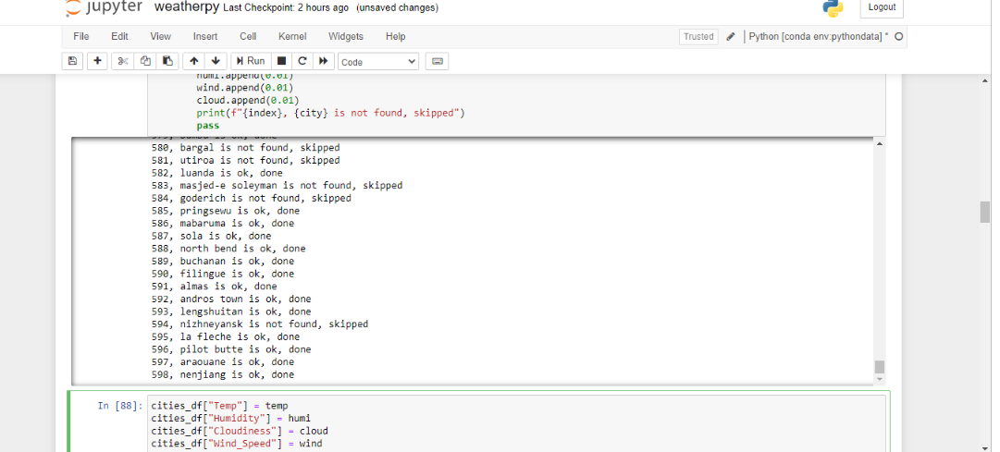
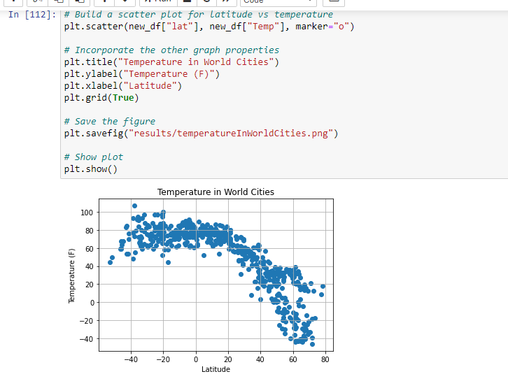
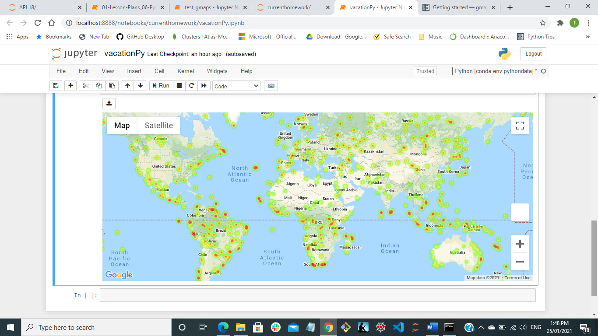
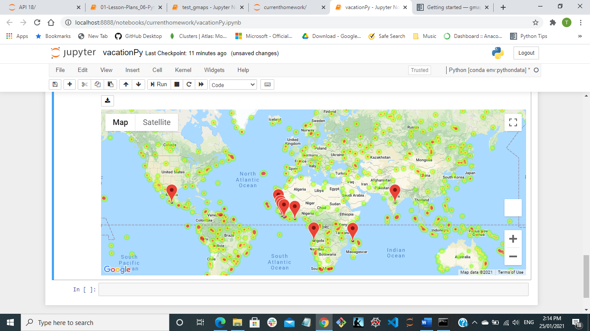
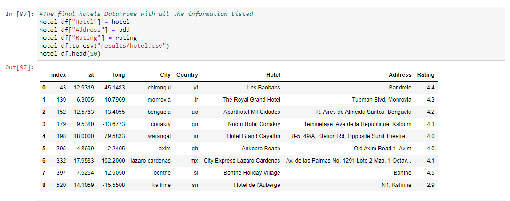

# python_API_challenge

The weatherPy and vacationPy are finished today 27/01/21.

## Background

To use Python requests, APIs, and JSON traversals to answer a fundamental question: "What's the weather like as we approach the equator?"

## Part I - WeatherPy

Create a Python script to visualize the weather of 500+ cities across the world of varying distance from the equator. To accomplish this, it utilizes a [simple Python library](https://pypi.python.org/pypi/citipy), the [OpenWeatherMap API](https://openweathermap.org/api), and a little common sense to create a representative model of weather across world cities.

The first requirement is to create a series of scatter plots to showcase the following relationships:

* Temperature (F) vs. Latitude
* Humidity (%) vs. Latitude
* Cloudiness (%) vs. Latitude
* Wind Speed (mph) vs. Latitude

After each plot add a sentence or too explaining what the code is and analyzing.

The second requirement is to run linear regression on each relationship, only this time separating them into Northern Hemisphere (greater than or equal to 0 degrees latitude) and Southern Hemisphere (less than 0 degrees latitude):

* Northern Hemisphere - Temperature (F) vs. Latitude
* Southern Hemisphere - Temperature (F) vs. Latitude
* Northern Hemisphere - Humidity (%) vs. Latitude
* Southern Hemisphere - Humidity (%) vs. Latitude
* Northern Hemisphere - Cloudiness (%) vs. Latitude
* Southern Hemisphere - Cloudiness (%) vs. Latitude
* Northern Hemisphere - Wind Speed (mph) vs. Latitude
* Southern Hemisphere - Wind Speed (mph) vs. Latitude

After each pair of plots explain what the linear regression is modeling such as any relationships noticed and any other analysis may worth notice.

The notebook must:

* Randomly select **at least** 500 unique (non-repeat) cities based on latitude and longitude.
* Perform a weather check on each of the cities using a series of successive API calls.
* Include a print log of each city as it's being processed with the city number and city name.
* Save a CSV of all retrieved data and a PNG image for each scatter plot.

* **More than 500 cities have been searched:**

* **Temperature distribution in the world cities:**

### Part II - VacationPy

Now let's work with weather data to plan future vacations. Use jupyter-gmaps and the Google Places API for this part of the assignment.

* **Create a heat map that displays the humidity for every city from the part I above.**

  

* Narrow down the DataFrame to find my ideal weather condition:

  * A max temperature lower than 80 degrees but higher than 70.

  * Wind speed less than 5 mph.

  * Cloudiness <= 5.

* Using Google Places API to find the first hotel for each city located within 5000 meters of your coordinates.

* Plot the hotels on top of the humidity heatmap with each pin containing the **Hotel Name**, **City**, and **Country**.

* **Selected hotels' location map:**
  
  
 * **Selected hotels' details:**
  
  

